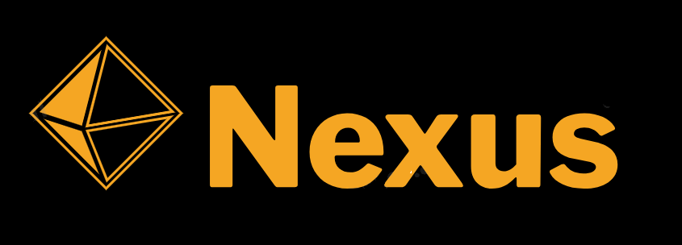

# The project code name Nexus. 

An python based algorithmic trading event driven framework.
Inspired by [Zorro](https://zorro-project.com/)

## Core functionality:
1. **Extensibility and Modularity:**
   - A plugin-based architecture to allow users to extend the framework with custom indicators, data feeds, and execution models.
   - Modular design to enable easy addition of new asset classes or order types.
2. **Event Processing:**
   - A robust event-driven architecture to handle real-time data processing, order management, and market events.
3. **Trading Capabilities:**
   - Support for both long and short trading strategies.
   - Implementation of both market and limit orders.
4. **Connectivity:**
   - Ability to connect to various data feeds, brokers, or exchanges through connectors.
5. **Asset Support:**
   - Compatibility with multiple asset classes, including futures, stocks, ETFs, and cryptocurrencies.
6. **Backtesting and Live Trading:**
   - A backtest module that allows for seamless switching between backtesting and live trading using the same strategy.
   - Ability to include multiple assets in both backtesting and live trading for portfolio or pair trading strategies.
7. **Data Handling:**
   - Support for different historical data sources, including OHLC and tick data.
   - Capability to read data from CSV files and optionally use Parquet or custom binary file formats for improved performance.
7. **Strategy Optimization:**
   - Modules for strategy optimization using techniques like grid search or Bayesian optimization.
   - Support for Walk Forward Optimization (WFO) to provide out-of-sample backtesting, enhancing the robustness of the strategy.
8. **Monte Carlo Analysis:**
   - Implementation of Monte Carlo analysis to resample the equity curve from backtesting. 
   - Generation of multiple equity curves to represent different trade orders and price movements for performance analysis.
9. **Performance and Speed:**
   - Use of multiprocessing to utilize multiple CPU cores for faster backtesting.
10. **Charting and Reporting:**
   - Charting functionality using Plotly for visualizing source data and strategy results, such as equity curves.
   - Generation of comprehensive strategy performance reports, including metrics like the number of trades, winning percentage, win/loss ratio, Sharpe ratio, and maximum drawdown.
11. **Testing and Code Quality:**
    - Comprehensive code coverage with tests to ensure the reliability and stability of the framework.

## Installation
- Nexus use `uv` - [an extremely fast Python package and project manager, written in Rust.](https://docs.astral.sh/uv)
- On Windows PC recommended clone repo inside WSL

###  Data harvesting
Historical data lives in `/history/<provider>` subfolder

#### Location of history data.
Store history files in ```/history``` directory.
Create subdirectory for storing specific market/broker like ```/history/zorro```
Don't forget to add apropriate configuration file for assetes. It mandatory name ```assets.csv```
It must stored in the same location as data history files.

#### Yahoo! Finance
Download some  OHLC market data from Yahoo! Finance's API:<br>

```uv run -m history.download-yf AAPL 2000-01-01 2025-01-01```
```uv run -m history.download-yf JNJ 2000-01-01 2025-01-01```
```uv run -m history.download-yf JPM 2000-01-01 2025-01-01```
```uv run -m history.download-yf PG 2000-01-01 2025-01-01```
```uv run -m history.download-yf NEE 2000-01-01 2025-01-01```

Data will be saved to `/history/yf`.
(Copy and Rename `Assets.csv.demo` to `Assets.csv` for backtester)

Plot OHLC market data chart:<br>
```uv run -m history.plot-csv history/yf/AAPL.csv```

### Finam API
Download tick market data from Finam API:<br>
```uv run -m history.download-finam```

Plot tick chart:<br>
```uv run -m history.plot-tick history/finam/RIH0_200103_200103.csv```

### Forex history data (t6 format) 
 - Download from here [Zorro](https://zorro-project.com/download.php), or grab some t6 files from Zorro's ```/History``` folder if it already installed.
 Nexus cache agregаted history data after first run in .feather format, for future faster processing!

### Binance API - Futures
Incremental Binance USDⓈ-M klines downloader:<br>
```uv run -m history.download-binance-futures```
| Goal                                 | Command                                                                      |
| ------------------------------------ | ---------------------------------------------------------------------------- |
| Plot last month, aggregate to 15 min | `uv run -m history.plot-klines --input history/binance-futures/BTCUSDT_1m.parquet --start 2025-06-15 --resample 15T`    |
| Just show the latest 10 k 1-min bars | `uv run -m history.plot-klines --input history/binance-futures/BTCUSDT_1m.parquet --thin 10000`                         |
| Last 48 h, save HTML file            | `uv run -m history.plot-klines --input history/binance-futures/BTCUSDT_1m.parquet --start 2025-07-06 --output btc.html` |

### Run:
- Moving average crossover strategy for single asset:<br>
   ```uv run -m backtests.ma_cross```

- Same strategy for portfolio of assets:<br>
   ```uv run -m backtests.ma_cross_portfolio```

- Same strategy for single asset with parameters optimization with multoprocessing support:<br>
   ```uv run -m backtests.ma_cross_optimize```

- Same strategy as above but with Walk Forward Optimization (WFO):<br> 
   ```uv run -m backtests.ma_cross_wfo```

- Simple trend folowing with laguerre filter for single asset:<br>
   ```uv run -m backtests.laguerre```

### Runing test
```uv run pytest tests/```
```uv run pytest tests/test_indicators.py```

### Demo of strategy coding
Processes market events and generates trading signals based on moving average crossovers.
```python
def run(self, event):
   """
   Main strategy function, it runs at the end of every bar.
   Processes market events and generates trading signals.
   """
   timestamp, symbol, prices, indicators = self.process_event(event)
   sma_short = self.sma_short[symbol]
   sma_long  = self.sma_long[symbol]
   
   # Calculate moving averages & update the SMA timeseries
   push(sma_short, SMA(prices, self.short_window))
   push(sma_long, SMA(prices, self.long_window))

   # Check for moving average crossover signals
   if cross_over(sma_short, sma_long):
      self.enterLong()
   elif cross_under(sma_short, sma_long):
      self.enterShort()

   # Store the moving averages and timestamp
   indicators['timestamps'].append(timestamp)
   indicators['sma_short']['values'].append(sma_short[0])
   indicators['sma_long']['values'].append(sma_long[0])
```
Source files with strategies source code lives in ```/strategy``` folder.

### Demo run backtest
```python
import logging
from nexus.backtest import Backtest
from nexus.feed.csv_ohlc import HistoricCSVDataHandler
from nexus.execution import SimulatedExecutionHandler
from nexus.portfolio import NaivePortfolio
from strategies.ma_cross import MovingAverageCrossStrategy

# Parameters
symbol_list = ['AAPL']
history_files = {'AAPL': 'data/AAPL.csv'}
initial_capital = 100000.0
start_date = '2013-01-01'
end_date = '2023-01-01'

# Strategy parameters
strategy_params = {
    'max_long' : -1,
    'max_short' : -1,
    'short_window': 10,
    'long_window': 20, 
}

backtest = Backtest(
    history_files=history_files,
    symbol_list=symbol_list,
    initial_capital=initial_capital,
    strategy_params=strategy_params,  
    strategy_class=MovingAverageCrossStrategy,
    data_handler_class=HistoricCSVDataHandler,
    execution_handler_class=SimulatedExecutionHandler,
    portfolio_class=NaivePortfolio,
    start_date=start_date,
    end_date=end_date,
    reporting=True,
    log_level=logging.DEBUG,
)

backtest.run()
```
Source files with backtest source code lives in ```/backtests``` folder.
You can run the same strategy from ```/strategies``` with different options, like portfolio trading, optimize strategy parameters or Walk Forward Optimization (WFO).

## Demo plots for spectral filters
- ```uv run -m nexus.indicators.demo.plot_waves``` plot demo waves.
- ```uv run -m nexus.indicators.demo.plot_filters_waves``` remake of Zorro's `Filter.c`, show **Laguerre**, **BandPass**  Filters on sin waves.
- ```uv run -m nexus.indicators.demo.plot_filters_data``` runs **Laguerre**, Ehler's **SuperSmoother**, **UltimateSmoother** filters, actual data file `history/binance-futures/BTCUSDT_1m.parquet` needed.
- ```uv run -m nexus.indicators.demo.plot_regime``` remake of Zorro's `Regime.c`, show **Auto-Correlation Index (ACI)**, **Fractal Dimension**, **Hurst exponent**, **Market Meanness Index** for market regime detection in action.
- ```uv run -m nexus.indicators.demo.plot_ehlers``` runs Ehler's filters (**UltimateSmoother**,**UltimateChannel**,**UltimateBands**), actual data file `history/binance-futures/BTCUSDT_1m.parquet` needed.
- ```ToDo``` remake of Zorro's `Impulse.c` 

## Examples
Examples from ["The Black Book of Financial Hacking" by Johann Christian Lotter](https://www.amazon.com/Black-Book-Financial-Hacking-Algorithmic-ebook/dp/B072BVXBFY) converted from Zorro’s lite-C to nexus framework lives in ```/blackbook``` folder.<br>
- From Chapter 3 **Follow the trend**,  basic lowpass filter strategy (page 64):
```uv run -m blackbook.alice1a```<br>
- From Chapter 4 **Against the trend**, The cycle trading algorithm  (page 88):
```uv run -m blackbook.alice2a```

Ref: [Zorro manual](https://zorro-project.com/manual/toc.php)

# Notes
*Zorros vs.Nexus*
- Series syntax (Nexus uses numpay array instead and ```from nexus.helpers import push```,  ```push(array, value)``` - shift (roll) array and put new value at [0] index.
- LookBack automatic calculation (Zorro).
- The LookBack period is added in front of the date and begins accordingly earlier (Zorro). 

Due some WSL issues for instantly open plotly plots, use:
```
from nexus.charting import show_plotly_figure
# ...
show_plotly_figure(fig) # WSL workaround, instead of fig.show()
```

Use ```uv run -m misc.dump2``` to dump selected repo files to be included in the LLM text prompt.

**Experimental**
### Building the Cython SMA extension
The simple moving average routine can be accelerated with Cython.
Install the required build tools and compile the extension in place:

```bash
uv pip install cython setuptools numpy
cythonize -i nexus/indicators/_cython_indicators.pyx
```

After compilation the optimized module is loaded automatically by `nexus`.

Run the benchmark script to compare the optimized SMA against the pure Python version:

```bash
uv run -m misc.benchmark_sma
```